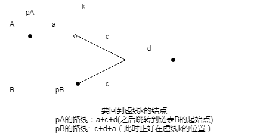

# 2021-02-19

## 1. [相交链表](https://leetcode-cn.com/problems/intersection-of-two-linked-lists/)

题号：#160

### 我的解答



```js
/**
 * Definition for singly-linked list.
 * function ListNode(val) {
 *     this.val = val;
 *     this.next = null;
 * }
 */

/**
 * @param {ListNode} headA
 * @param {ListNode} headB
 * @return {ListNode}
 */
var getIntersectionNode = function(headA, headB) {
   if(headA === null || headB === null){
       return null;
   }
   let pA = headA;
   let pB = headB;
   while(pA!==pB){
       pA = pA === null? headB:pA.next;
       pB = pB === null? headA:pB.next;
   } 
   return pA;
};
```

执行用时：108 ms, 在所有 JavaScript 提交中击败了89.03%的用户

内存消耗：45.3 MB, 在所有 JavaScript 提交中击败了36.18%的用户


### 最小时间

```js
/**
 * Definition for singly-linked list.
 * function ListNode(val) {
 *     this.val = val;
 *     this.next = null;
 * }
 */

/**
 * @param {ListNode} headA
 * @param {ListNode} headB
 * @return {ListNode}
 */
var getIntersectionNode = function(headA, headB) {
   let map = new Map()
    while(headA){
        map.set(headA, true)
        headA = headA.next
    }

    while(headB){
        if(map.has(headB)){
            break
        }
        headB = headB.next
    }
    return headB 
};
```

### 最小内存

```js
/**
 * Definition for singly-linked list.
 * function ListNode(val) {
 *     this.val = val;
 *     this.next = null;
 * }
 */

/**
 * @param {ListNode} headA
 * @param {ListNode} headB
 * @return {ListNode}
 */
var getIntersectionNode = function(headA, headB) {
   let PA = headA
   let PB = headB
   while(PA || PB) {
       if(PA === PB) return PA
       PA = PA === null ? headB : PA.next
       PB = PB === null ? headA : PB.next
   }
   return null
};
```

