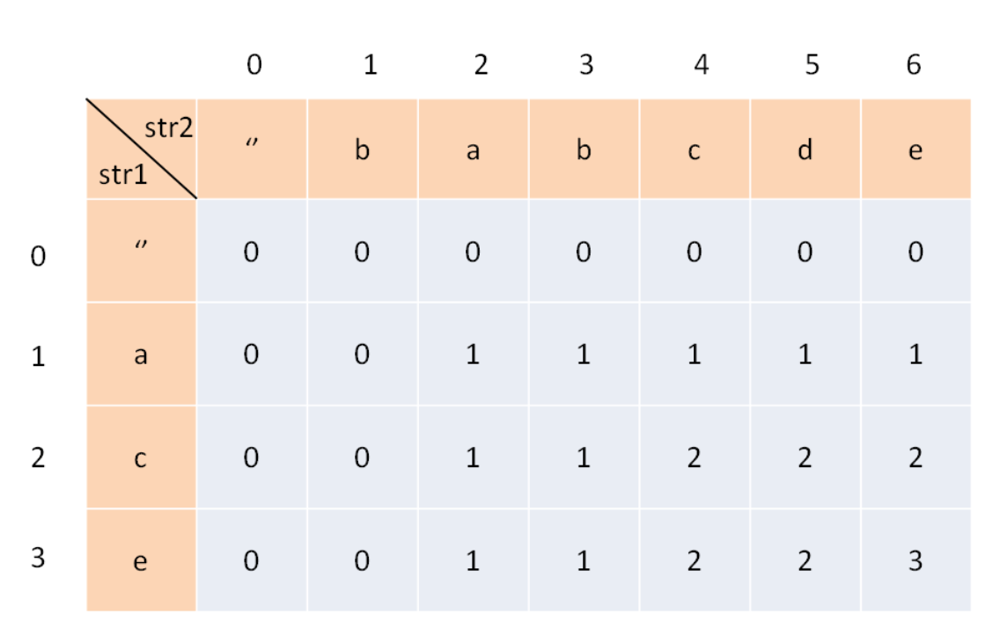

# 2021-03-20

## 1.[最大子序和](https://leetcode-cn.com/problems/maximum-subarray/)

题号：#53

### 我的解答

```js
/**
 * @param {number[]} nums
 * @return {number}
 */
var maxSubArray = function(nums) {
  let dp = Number.MIN_SAFE_INTEGER; // 当前索引的dp
  let res = Number.MIN_SAFE_INTEGER; // 存储比较的结果
  for (let i = 0; i < nums.length; i++) {
    dp = Math.max(nums[i], dp + nums[i]); // 当前的dp要不是当前值，那么与之前的值相连
    res = Math.max(res, dp); // 比较之前的dp和现在的dp
  }
  return res;
};
```

执行用时：84 ms, 在所有 JavaScript 提交中击败了85.64%的用户

内存消耗：39.4 MB, 在所有 JavaScript 提交中击败了39.12%的用户

### 最少耗时

```js
/**
 * @param {number[]} nums
 * @return {number}
 */
var maxSubArray = function(nums) {
    let ans = nums[0]
    let sum = 0
    for(let i=0; i<nums.length; i++){
        if(sum > 0){
            sum += nums[i]
        }else{
            sum = nums[i]
        }
        ans = Math.max(ans, sum)
    }
    return ans
};
```

### 最小内存

```js
/**
 * @param {number[]} nums
 * @return {number}
 */
var maxSubArray = function(nums) {
  let pre = 0
  let max = nums[0]
  for (let i = 0; i < nums.length; i++) {
    pre = Math.max(pre + nums[i], nums[i])
    max = Math.max(max, pre)
  }
  return max
};
```

## 优化版

```js
/**
 * @param {number[]} nums
 * @return {number}
 */
var maxSubArray = function(nums) {
  let dp = nums[0]; // 当前索引的dp,默认为第一位，防止为负数的情况
  let res = nums[0]; // 存储比较的结果
  for (let i = 1; i < nums.length; i++) {
    dp = Math.max(nums[i], dp + nums[i]); // 当前的dp要不是当前值，那么与之前的值相连
    res = Math.max(res, dp); // 比较之前的dp和现在的dp
  }
  return res;
};
```

## 2. [最长公共子序列](https://leetcode-cn.com/problems/longest-common-subsequence/)(CLS问题)

题号：#1143

### 我的解法，大佬的

```js
/**
 * @param {string} text1
 * @param {string} text2
 * @return {number}
 * 输入两个数组，找出最长公共子序列，存储公共子序列，即对应的最后text2索引
 * 输出：最长公共子序列的长度
 */
var longestCommonSubsequence = function (text1, text2) {
  let m = text1.length;
  let n = text2.length;
  let dp = Array.from(Array(m + 1), () => Array(n + 1).fill(0));
  for (let i = 0; i < m; i++) {
    for (let j = 0; j < n; j++) {
      // 获取两个串字符
      let c1 = text1.charAt(i);
      let c2 = text2.charAt(j);
      if (c1 == c2) {
        // 去找它们前面各退一格的值加1即可
        dp[i + 1][j + 1] = dp[i][j] + 1;
      } else {
        //要么是text1往前退一格，要么是text2往前退一格，两个的最大值
        dp[i + 1][j + 1] = Math.max(dp[i + 1][j], dp[i][j + 1]);
      }
    }
  }
  return dp[m][n];
};

```

执行用时：116 ms, 在所有 JavaScript 提交中击败了75.52%的用户

内存消耗：51.6 MB, 在所有 JavaScript 提交中击败了38.61%的用户

### 最少耗时

```js
/**
 * @param {string} text1
 * @param {string} text2
 * @return {number}
 */
var longestCommonSubsequence = function(text1, text2) {
    let dp = new Array(text1.length + 1);
 
    dp[0] = new Array(text2.length + 1);
    dp[0].fill(0);
    for (let i = 0;i < text1.length;i++ ) {
        dp[i + 1] = new Array(text2.length + 1);
        dp[i + 1][0] = 0;  
         
        for (let j = 0;j < text2.length;j++ ) {
            if (text2[j] === text1[i]) {
                dp[i + 1][j + 1] = dp[i][j] + 1;
                
            } else {
                dp[i + 1][j + 1] = Math.max(dp[i][j + 1], dp[i + 1][j]);
            }
        }
        
    }
    //console.log(dp);
    return dp.pop().pop()
};
```

### 最小内存

```js
/**
 * @param {string} text1
 * @param {string} text2
 * @return {number}
 */
var longestCommonSubsequence = function(text1, text2) {
  let arr1 = text1.split('');
  let arr2 = text2.split('');

  let dp = new Array(arr2.length + 1).fill(0);

  for (let i = 1; i <= arr1.length; i++) {
    let cur = 0;
    for (let j = 1; j <= arr2.length; j++) {
      let leftTop = cur;
      cur = dp[j];
      if (arr1[i - 1] === arr2[j - 1]) {
        dp[j] = leftTop + 1;
      } else {
        dp[j] = Math.max(dp[j - 1], dp[j]);
      }
    }
  }

  return dp[arr2.length];
};
```

- 不是很懂，参考https://leetcode-cn.com/problems/longest-common-subsequence/solution/dong-tai-gui-hua-tu-wen-jie-xi-by-yijiaoqian/

如下：构建DP表



1. 找出状态

`dp[i][j]`: s1[1..i]和s2[1...i]的最小公共序列。`dp[2][4]`意味着对于字符"ac"和字符"babc"的lsc为2。因为，所有字符串的lcs在最后一格。

2. 确定基准条件

- 全部初始化为0，表示为空字符
- `dp[0][3]=0`，代表字符`""`和字符串"bab"的lcs为0

3. 状态转移方程式
   - 选项：字符在lcs中，字符不在lcs中
     - 如果是lcs，字符必须在s1中，也必须在s2中
   - 参考如下代码

```js
/**
 * @param {string} text1
 * @param {string} text2
 * @return {number}
 * 输入两个数组，找出最长公共子序列，存储公共子序列，即对应的最后text2索引
 * 输出：最长公共子序列的长度
 */
var longestCommonSubsequence = function (text1, text2) {
  let m = text1.length;
  let n = text2.length;
  let dp = Array.from(Array(m + 1), () => Array(n + 1).fill(0));
  for (let i = 0; i < m; i++) {
    for (let j = 0; j < n; j++) {
      // 注意此处的i,j和dp表的不同, dp表每次都会下标+1，是因为dp表将空字符串算作第一项，全部初始化为0，所以要找到当前字符在dp表的对应位置，必须要加1
      let c1 = text1.charAt(i);
      let c2 = text2.charAt(j);
      if (c1 == c2) {
        dp[i + 1][j + 1] = dp[i][j] + 1;
      } else {
        // 取两个斜对角的最大值， 因为此时两个字符不相同，那么我们要将之前字符的比较关系转移过来，也就是原来的cls保存下来，这个位置就是当前dp的左上角和左侧，取最大即可
        dp[i + 1][j + 1] = Math.max(dp[i + 1][j], dp[i][j + 1]);
      }
      console.log("dp", JSON.stringify(dp));
    }
  }
  return dp[m][n];
};

```

