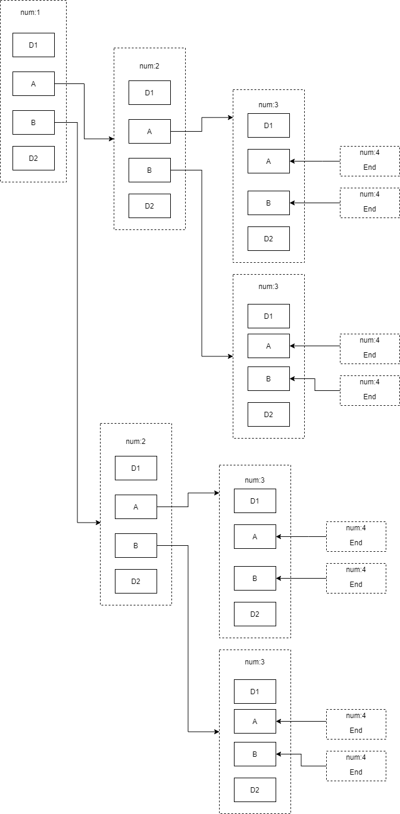

# 递归

## 数学描述

计算从1加到100

```js
{
    f(n) = 1; // n==1; --> base case
    f(n) = n + f(n-1); // n>1
}
```

## 基准条件(base condition)

如上

## 栈溢出(stack overflow)

当未定义基准条件或者不能达到基准条件，会因为内存耗尽而出现栈溢出

## 直接递归(direct recursion)和间接递归(indirect recursion)

### 直接递归

```js
function funcA(){
    funcA
}
```

### 间接递归

```js
function funcA(){
    funcB();
}

function funcB(){
    funcA();
}
```

## 尾递归(tail-recursion)

> 递归方法是函数最后执行的。

```js
function rec(num){
    if(n<0){
        return;
    }
    console.log("num===", num);
   	rec(num - 1);
}
```

- 尾递归：快速排序
- 非尾递归：归并排序

## 内存分配

```js
function rec(num) {
    if (num < 1) {
      return;
    } else {
          console.log("num-before", num);
          rec(num - 1);
          console.log("num-after", num);
        }
    }
rec(3);
```

## 注意看以下程序

```js
const rec = function (num) {
    if (num > 3) {
      return;
    }
    console.log("num---before", num);
    rec(num + 1);
    console.log("num---after", num);
    };
rec(1);
```

那么，其依次输出：

```text
num---before 1
num---before 2
num---before 3
num---after 3
num---after 2
num---after 1
```

- 如果一个函数中包含子函数，那么一定要等子函数全部执行完毕，才会执行子函数之后内容。
- 执行子函数时，父函数中的变量仍然会保持。

注意看以下内容：

```js
const rec = function (num) {
    if (num > 3) {
      return;
    }
    console.log("num---before", num); // D1
    rec(num + 1);  // A
    rec(num + 1); // B
    console.log("num---after", num); // D2
};
rec(1);
```

其输出内容为：

```js
num---before 1
num---before 2
num---before 3
num---after 3
num---before 3
num---after 3
num---after 2
num---before 2
num---before 3
num---after 3
num---before 3
num---after 3
num---after 2
num---after 1
```

其执行逻辑为：



其相当于以下程序：

```js
 const rec = function (num) {
    if (num > 3) {
      return;
    }
    console.log("num---before", num);
    for (let i = 0; i < 2; i++) {
      rec(num + 1);
    }
    console.log("num---after", num);
  };
  rec(1);
```

思考以下程序，其输出为？

```js
const rec = function (num) {
    if (num > 3) {
      return;
    }
    for (let i = 0; i < 2; i++) {
      console.log("num---before", num);
      rec(num + 1);
      console.log("num---after", num);
    }
  };
rec(1);
```

输出：

```bash
num---before 1
num---before 2
num---before 3
num---after 3
num---before 3
num---after 3
num---after 2
num---before 2
num---before 3
num---after 3
num---before 3
num---after 3
num---after 2
num---after 1
num---before 1
num---before 2
num---before 3
num---after 3
num---before 3
num---after 3
num---after 2
num---before 2
num---before 3
num---after 3
num---before 3
num---after 3
num---after 2
num---after 1
```

考虑回溯算法如下：

```js
const subsets = function (nums) {
    let track = [];
    let res = [];

    const backtrack = function (nums, start, track) {
      res.push(JSON.parse(JSON.stringify(track)));
      for (let i = start; i < nums.length; i++) {
        track.push(nums[i]);
        backtrack(nums, i + 1, track);
        track.pop();
      }
    };

    backtrack(nums, 0, track);
    return res;
};
```

